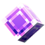

  

<h1 align="center">HyLauncher</h1>

  <strong>El launcher oficial de HyServer</strong> 
  Abre, inicia sesión y juega — Minecraft listo, mods sincronizados, servidor en un clic.

  <a href="https://byhyped.com">byhyped.com</a>
  ·
  Minecraft 1.20.1
  ·
  Fabric

---

## ¿Qué es HyLauncher?

HyLauncher es el launcher de Minecraft de **HyServer**: una experiencia pensada para jugadores, no para configurar carpetas ni pelearse con Java.

Instala el juego, sincroniza el modpack oficial y te conecta al servidor. Sin pasos técnicos de más.

---

## Características

| | |
|---|---|
| **Cuenta Premium** | Inicia sesión con Microsoft y juega con tu skin oficial. |
| **Cuenta Offline** | Entra con un nombre de usuario cuando el servidor lo permita. |
| **Mods al día** | Descarga e instala solo lo que falta. Se mantiene sincronizado con el pack del servidor. |
| **Listo para jugar** | Minecraft, Fabric y el pack se preparan por ti. |
| **Ajustes claros** | RAM, idioma (ES / EN) y Discord Rich Presence. |
| **Texturas y shaders** | Packs opcionales para personalizar tu experiencia. |

---

## Cómo empezar

1. Descarga e instala **HyLauncher**.
2. Abre la app e inicia sesión (Premium u Offline).
3. Deja que sincronice el modpack la primera vez.
4. Pulsa **Lanzar juego** y entra a HyServer.

---

## Requisitos

- **Windows 10 / 11**
- **Java 17** (o superior) instalado en el sistema
- Conexión a internet para instalar y actualizar el pack
- Discord (opcional) si quieres mostrar que estás usando el launcher

---

## Idiomas

Interfaz disponible en **español** e **inglés** desde Ajustes → General.

---

## Soporte

¿Problemas al instalar, iniciar sesión o conectar al servidor?

Visita **[byhyped.com](https://byhyped.com)** o contacta al equipo de HyServer / HYPE.

---

## Aviso legal

HyLauncher **no está afiliado** a Mojang Studios ni a Microsoft.  
Minecraft es una marca registrada de Mojang Synergies AB.

Los mods y recursos de terceros pertenecen a sus respectivos autores y se distribuyen según sus licencias.

---

## Licencia y propiedad

© HYPE — [byhyped.com](https://byhyped.com)

**HyLauncher** y el material asociado son **propiedad exclusiva de HYPE**.  
Todos los derechos reservados.

Queda prohibida la copia, modificación, redistribución o uso comercial no autorizado sin permiso escrito de HYPE.

Consulta el archivo [`LICENSE`](LICENSE) para el texto completo.
